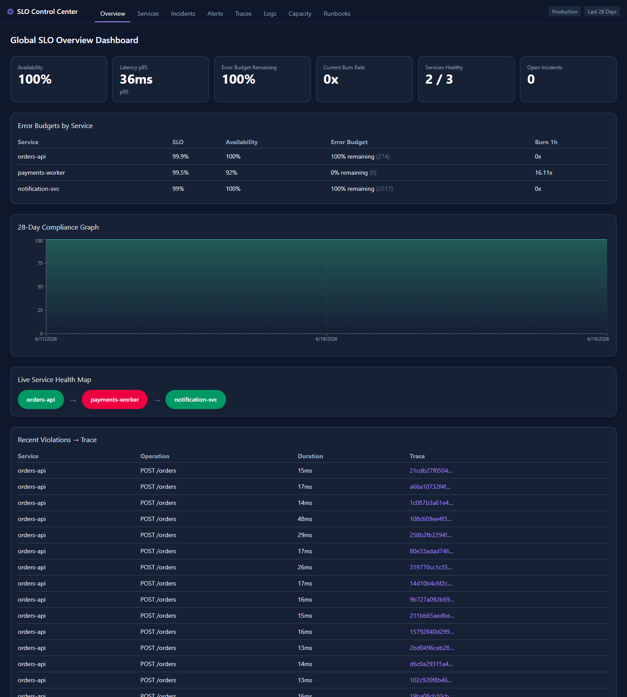
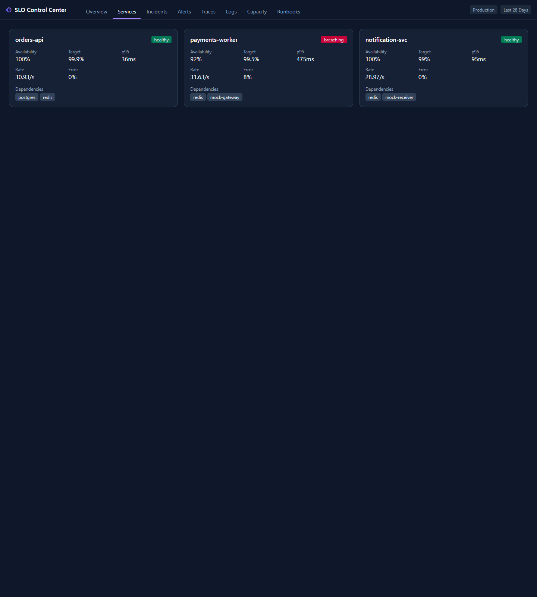
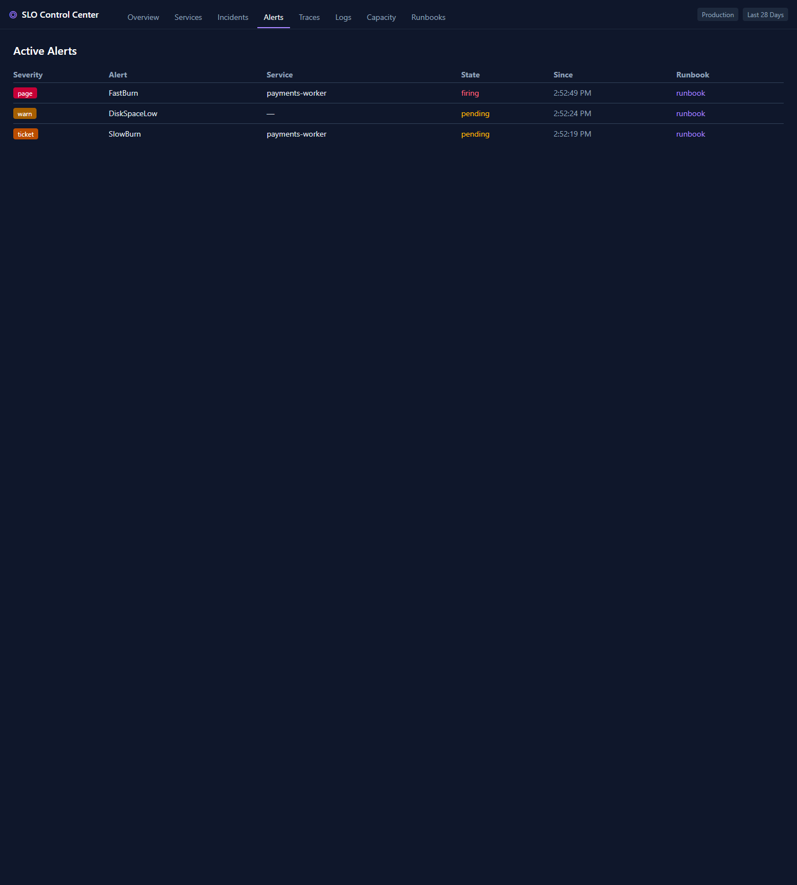
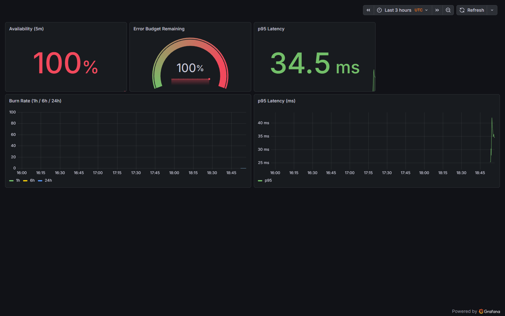

# SLO Control Center

A runnable, end-to-end SLO observability reference stack: sample microservices
with chaos hooks, Prometheus SLO recording rules + burn-rate alerting,
distributed tracing (OpenTelemetry → Tempo) and logs (Loki) correlated by
trace ID, a custom **SLO Control Center** React app, Grafonnet
dashboards-as-code, deterministic k6 load, runbooks, auto-verifying chaos
scenarios, and both Docker Compose and Kubernetes (kind + Kustomize) deploys.

Built as six decomposed sub-projects; see the specs in
[`docs/superpowers/specs`](docs/superpowers/specs/), the plans in
[`docs/superpowers/plans`](docs/superpowers/plans/), and the
[demo walkthrough](docs/DEMO.md).



> Real screenshot from the running stack: `orders-api` healthy, `payments-worker`
> breaching its 99.5% target (the mock gateway flakes ~8% by design), and a live
> distributed trace feed.

## Architecture

```
k6 ──load──> orders-api (Go) ──> Postgres
                  │ XADD payments (Redis Stream)
                  v
            payments-worker (Py) ──> mock-gateway (deterministic flake)
                  │ XADD notifications (Redis Stream)
                  v
            notification-svc (Go) ──> mock-receiver (webhook sink)

  All services expose /metrics ──> Prometheus ── recording rules
                                     │ (SLI, error budget, burn rate, p95)
              ┌──────────────────────┴───────────────────────┐
              v                                               v
         slo-bff (Go)                                 Grafana (Grafonnet)
              │ GET /api/slo (JSON, all 3 services)
              v
       SLO Control Center (React + Vite + Tailwind + Recharts)
```

Both dashboards read the **same** Prometheus recording rules — one source of truth.

### Services & SLOs

| Service | Lang | SLO |
|---------|------|-----|
| orders-api | Go | 99.9% availability / 28d, 200ms p95 |
| payments-worker | Python | 99.5% of payments succeed within 60s |
| notification-svc | Go | 99% of notifications delivered within 5s |

`mock-gateway` flakes ~8% deterministically (by `hash(order_id)`), so
`payments-worker` runs *below* its 99.5% target by design — the SLO catches a
dependency worse than its target.

## Quick start

Requires Docker Desktop. From the repo root:

```bash
docker compose -f deploy/compose/docker-compose.yml up --build -d
```

(or `make up` if you have `make`). Give it ~60–90s to build and warm up, then:

| Surface | URL |
|---------|-----|
| SLO Control Center (custom UI — 8 tabs) | http://localhost:3000 |
| Grafana (4 dashboards) | http://localhost:3001 (anonymous admin) |
| Prometheus | http://localhost:9091 |
| Tempo (traces) | http://localhost:3200 |
| Loki (logs) | http://localhost:3100 |
| Alertmanager | http://localhost:9093 |
| Alert receiver (recorded alerts) | http://localhost:8092/alerts |
| BFF JSON API | http://localhost:9090/api/slo |
| orders-api | http://localhost:8080 |

Tear down with `docker compose -f deploy/compose/docker-compose.yml down -v`.

## Custom UI (SLO Control Center)

A React (Vite + Tailwind + react-router) SPA with 8 tabs, all fed by the BFF:
**Overview** (SLOs, error budgets, 28d compliance, health map), **Services**
(RED + dependencies per service), **Incidents** (derived from firing alerts),
**Alerts** (active alerts + runbook links), **Traces** (recent Tempo traces →
Grafana), **Logs** (recent Loki lines with trace IDs), **Capacity** (per-container
CPU/mem/disk from cadvisor), and **Runbooks** (the `docs/runbooks/` markdown,
rendered).



Grafana ships 4 Grafonnet dashboards: **SLO Overview**, **Incident
Investigation**, **Service Drilldown** (templated by service), and
**Capacity / USE**.

## Telemetry & correlation

Every service is traced with OpenTelemetry → OTel Collector → **Tempo**, and logs
structured JSON → promtail → **Loki**. Trace context propagates **through the
Redis streams**, so one payment is a single distributed trace spanning
`orders-api → payments-worker → mock-gateway` (and `→ notification-svc →
mock-receiver` on success).

- Failed payments mark their span as an error and log `{"level":"error",...,"trace_id":...}`.
- The custom UI's **Recent Violations → Trace** panel and the BFF
  `GET /api/traces/recent` list error traces (queried from Tempo), each linking
  into Grafana.
- In Grafana: latency-panel **exemplars → Tempo**, Loki **`trace_id` → Tempo**,
  and Tempo **trace → Loki logs** are wired via datasource provisioning. The
  **Incident Investigation** dashboard combines error-rate + burn-rate metrics
  with an error-logs panel.

## Alerting & runbooks

Prometheus evaluates burn-rate + liveness alert rules
([`alerts.yml`](observability/prometheus/rules/alerts.yml)) and ships them to
**Alertmanager**, which routes by severity (`page`/`ticket`/`warn`) to a mock
**alert-receiver** webhook sink (see recorded alerts at
http://localhost:8092/alerts).

| Alert | Trigger | Severity | Runbook |
|-------|---------|----------|---------|
| `FastBurn` | >2% of 28d budget burned in 1h | page | [docs/runbooks/fast-burn.md](docs/runbooks/fast-burn.md) |
| `SlowBurn` | >10% burned in 6h | ticket | [docs/runbooks/slow-burn.md](docs/runbooks/slow-burn.md) |
| `ServiceDown` | scrape `up==0` for 2m | page | [docs/runbooks/service-down.md](docs/runbooks/service-down.md) |
| `DiskSpaceLow` | container fs >90% (cadvisor) | warn | [docs/runbooks/disk-space.md](docs/runbooks/disk-space.md) |

Alert rules are unit-tested with `promtool test rules` (`alerts.test.yml`).



## Chaos scenarios

Scripts in [`chaos/`](chaos/) perturb the live stack and **auto-verify** the
expected alert/metric, then revert (see [chaos/README.md](chaos/README.md)):

```bash
bash chaos/error-burst.sh       # CHAOS_ERROR_RATE=0.8 → FastBurn (orders-api)
bash chaos/service-down.sh      # stop orders-api      → ServiceDown
bash chaos/payments-latency.sh  # gateway LATENCY_MS=900 → payments p95 breach
```

## Triggering chaos

The `orders-api` injects faults from env vars. Set them and recreate the service:

```bash
# Windows PowerShell
$env:CHAOS_ERROR_RATE=0.2; docker compose -f deploy/compose/docker-compose.yml up -d --build orders-api

# bash
CHAOS_ERROR_RATE=0.2 docker compose -f deploy/compose/docker-compose.yml up -d --build orders-api
```

Within ~1–2 minutes the SLI drops and burn rate rises in **both** the custom UI
and Grafana. Knobs (see `deploy/compose/.env.example`):

- `CHAOS_ERROR_RATE` — fraction of requests forced to 5xx (0..1)
- `CHAOS_LATENCY_MS` — injected latency in ms
- `CHAOS_LATENCY_PCT` — fraction of requests that get the latency (0..1)

## Kubernetes (kind + Kustomize)

The full stack also runs on Kubernetes via Kustomize, deployable to a local
[kind](https://kind.sigs.k8s.io/) cluster:

```bash
make k8s-up      # create the kind cluster (deploy/k8s/kind-cluster.yaml)
make deploy      # build + load images, apply deploy/k8s/overlays/staging
kubectl -n slo get pods
kubectl -n slo port-forward svc/frontend 3000:80    # custom UI
kubectl -n slo port-forward svc/slo-bff 9090:9090   # the UI's BFF
# Grafana is exposed via NodePort at http://localhost:30001
make k8s-down    # tear down
```

`deploy/k8s/base/` holds Deployments/Services for every component; configs are
reused from `observability/**` + `docs/runbooks/` via Kustomize
`configMapGenerator` (single source of truth — built with
`--load-restrictor LoadRestrictionsNone`). The `overlays/staging/` overlay layers
on staging markers.

**K8s v1 scope:** the log/metric collector DaemonSets (promtail, cadvisor —
RBAC/hostPath) are proven in the Compose stack and omitted here; traces still flow
(services → otel-collector → Tempo). The disk-pressure scenario uses K8s-native
ephemeral-storage eviction (`bash chaos/disk-fill-k8s.sh`) rather than the
cadvisor-based `DiskSpaceLow` alert. Non-goals remain TLS/secrets/RBAC hardening,
PVs/StatefulSets, multi-node, and an external registry.

## Tests

`make test`, or individually:

```bash
cd services/orders-api       && go test ./...    # chaos logic + handlers + enqueue + trace inject
cd services/slo-bff          && go test ./...    # PromQL/Tempo/Loki -> JSON mappers (all endpoints)
cd services/notification-svc && go test ./...    # delivery classification + trace extract
cd services/mock-gateway     && go test ./...    # deterministic flake
cd services/alert-receiver   && go test ./...    # Alertmanager webhook parsing
cd services/payments-worker  && python -m pytest # deadline classification + trace propagation
cd frontend                  && npx vitest run   # tab views (9 tests)
# Prometheus recording-rule + alert unit tests:
docker run --rm --entrypoint promtool \
  -v "${PWD}/observability/prometheus/rules:/rules" -w /rules \
  prom/prometheus:latest test rules orders-api.slo.rules.test.yml mesh.slo.rules.test.yml alerts.test.yml
```

## Dashboards as code

All 4 Grafana dashboards are generated from Grafonnet sources in
[`observability/grafana/jsonnet/`](observability/grafana/jsonnet/) — no manual UI
editing. Regenerate with `make dashboards` (needs
`go install github.com/google/go-jsonnet/cmd/jsonnet@latest` and
`github.com/jsonnet-bundler/jsonnet-bundler/cmd/jb@latest`). The committed
`observability/grafana/dashboards/*.json` are the provisioned artifacts.



## SLO definitions

| Service | SLO | Recording rules |
|---------|-----|-----------------|
| orders-api | 99.9% availability / 28d, 200ms p95 | [`orders-api.slo.rules.yml`](observability/prometheus/rules/orders-api.slo.rules.yml) |
| payments-worker | 99.5% of payments succeed within 60s | [`mesh.slo.rules.yml`](observability/prometheus/rules/mesh.slo.rules.yml) |
| notification-svc | 99% of notifications delivered within 5s | [`mesh.slo.rules.yml`](observability/prometheus/rules/mesh.slo.rules.yml) |

Each computes SLI, error budget (% + count), multi-window burn rate, and p95.

## Repository layout

```
services/        orders-api, payments-worker, notification-svc, mock-gateway,
                 mock-receiver, slo-bff, alert-receiver (per-service Dockerfiles)
frontend/        React + Vite + Tailwind SPA (8 tabs)
observability/   prometheus (config + rules + tests), grafana (Grafonnet + provisioning),
                 alertmanager, tempo, loki, promtail, otel
load/k6/         deterministic load script
chaos/           auto-verifying chaos scenarios (+ K8s disk-fill)
docs/            specs, plans, runbooks, DEMO.md
deploy/compose/  docker-compose stack
deploy/k8s/      Kustomize base + staging overlay (kind)
Makefile         up / down / test / dashboards / k8s-up / deploy / k8s-down
```
